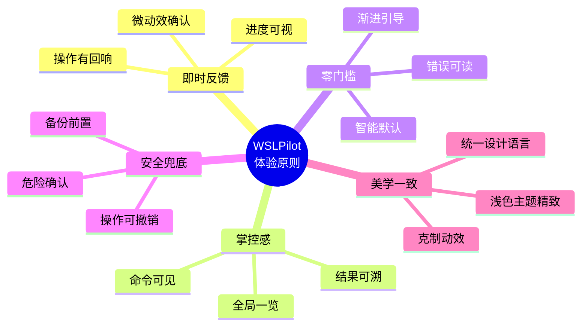
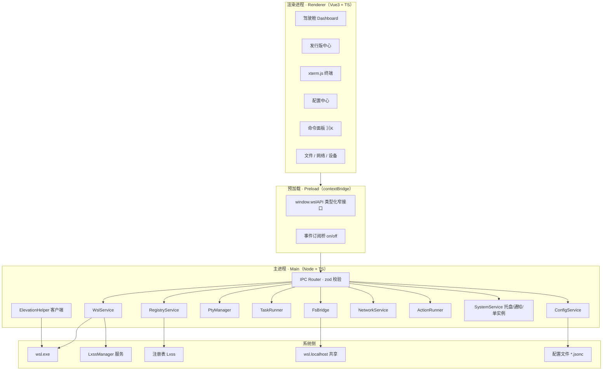
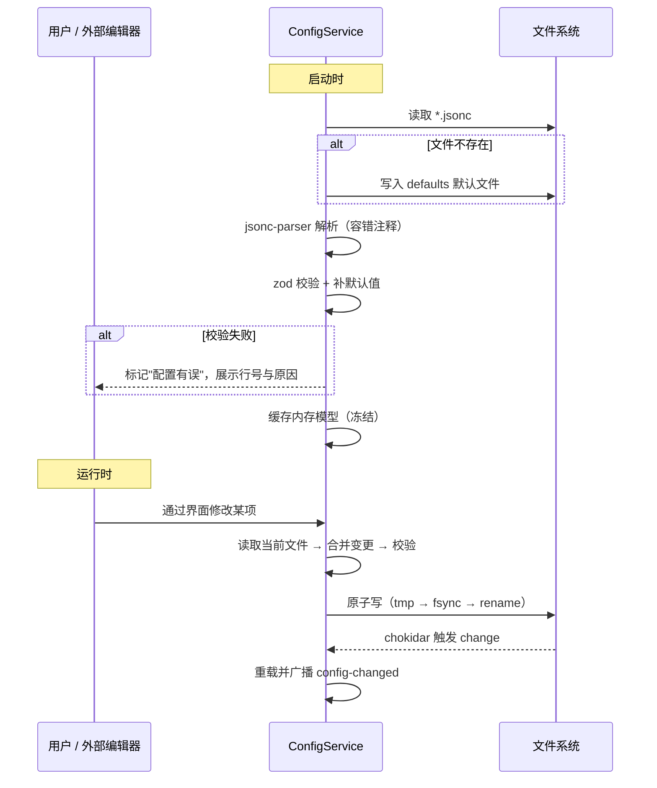
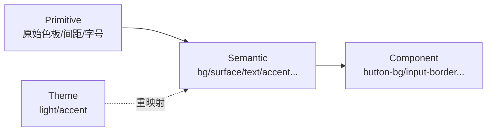

# WSLPilot · 设计书

> **WSLPilot** —— 让 Windows 上的 Linux 发行版触手可及的现代化控制中枢。
> 技术栈：**TypeScript + Vue 3 + Electron**；持久化：**JSONC 配置文件**（**无数据库**）。
> 设计基调：现代、精美、克制而富有反馈感的「仪表盘」级桌面体验。

| 项目     | 说明                                           |
| -------- | ---------------------------------------------- |
| 产品名称 | **WSLPilot**（WSL + Pilot，寓意"领航员"）      |
| 文档版本 | v2.0                                           |
| 项目代号 | pilot                                          |
| 目标平台 | Windows 10 2004+ / Windows 11（x64 / arm64）   |
| 技术栈   | TypeScript 5 · Vue 3 · Electron · Vite · Pinia |
| 持久化   | JSONC 配置文件（无任何数据库）                 |
| 外部依赖 | wsl.exe · LxssManager · node-pty · xterm.js    |
| 许可     | MIT                                            |

---

## 目录

1. [产品概述](#1-产品概述)
2. [设计理念与体验原则](#2-设计理念与体验原则)
3. [技术选型与理由](#3-技术选型与理由)
4. [系统架构](#4-系统架构)
5. [完整工程结构](#5-完整工程结构)
6. [配置文件设计（核心）](#6-配置文件设计核心)
7. [领域模型与类型定义](#7-领域模型与类型定义)
8. [IPC 契约](#8-ipc-契约)
9. [核心服务设计](#9-核心服务设计)
10. [设计系统 Design System](#10-设计系统-design-system)
11. [UI/UX 设计规范](#11-uiux-设计规范)
12. [界面详细设计](#12-界面详细设计)
13. [交互与动效设计](#13-交互与动效设计)
14. [安全设计](#14-安全设计)
15. [错误处理与可观测性](#15-错误处理与可观测性)
16. [测试策略](#16-测试策略)
17. [构建与发布](#17-构建与发布)
18. [配置文件版本迁移](#18-配置文件版本迁移)
19. [性能与资源](#19-性能与资源)
20. [里程碑规划](#20-里程碑规划)
21. [风险与对策](#21-风险与对策)
22. [附录](#22-附录)

---

## 1. 产品概述

### 1.1 项目背景

Windows Subsystem for Linux 已成为开发者的标准工作环境，但其管理方式长期停留在命令行：查状态要 `wsl -l -v`，装发行版要背 `wsl --install -d`，备份迁移要敲 `--export/--import`，资源限额要手改 `.wslconfig`，USB 设备要记 `usbipd` 参数。命令分散、参数易错、缺少可视化反馈，构成了 WSL 用户的三大日常摩擦。

**WSLPilot** 的使命，就是把这些散落的命令收敛为一个**有驾驶舱体验**的图形化控制中枢——既保留命令行的全部能力与透明度，又提供现代桌面应用应有的美观、顺手与安全感。

### 1.2 一句话定位

> **WSLPilot = WSL 的驾驶舱。** 像开飞机一样管理你的 Linux 发行版：一眼看清全局，一键完成操作，一切尽在掌握。

### 1.3 设计目标

| 维度         | 目标                                                           |
| ------------ | -------------------------------------------------------------- |
| **易用性**   | 常用动作（启停、设默认、安装、备份、迁移）≤ 3 次点击完成       |
| **美观性**   | 现代设计系统、流光质感、精细动效，达到"愿意截图分享"的视觉水准 |
| **便捷性**   | 全局命令面板（⌘K）、托盘快速操作、快捷键全覆盖                 |
| **透明性**   | 所有持久化状态为人类可读 JSONC，路径可见、内容可改、可纳入 Git |
| **安全性**   | 渲染进程零 Node 权限，IPC 白名单，危险操作二次确认             |
| **无数据库** | 不引入嵌入式数据库；配置文件天然适合"单人单机低频写"场景       |
| **可扩展**   | 配置 schema + 自定义动作（Actions）机制，用户可注入命令流      |

### 1.4 非目标（Non-Goals）

- 不做跨机器同步、云账户、多人协作（无数据库亦无服务端）。
- 不接管 WSLg 的 X11/Wayland 桌面会话。
- 不替代 `wsl.exe`，只做编排与可视化，绝不擅自改动发行版内部业务数据。
- v1 不做插件市场，自定义能力以配置文件声明为主。

### 1.5 目标用户画像

| 画像                   | 特征                            | 核心诉求                       |
| ---------------------- | ------------------------------- | ------------------------------ |
| **全栈开发者（主力）** | 日常在 WSL 中开发，有多个发行版 | 快速切换、备份迁移、终端集成   |
| **数据/算法工程师**    | 关注资源、GPU、USB 设备         | 资源限额可视化、设备绑定       |
| **学习者 / 新手**      | 刚接触 WSL，怕敲错命令          | 图形化引导、命令可见、安全提示 |
| **极客 / 折腾党**      | 喜欢手改配置、写自定义动作      | 配置可读可改、Actions 可扩展   |

### 1.6 术语表

| 术语            | 含义                                                             |
| --------------- | ---------------------------------------------------------------- |
| Distro / 发行版 | 一个已注册的 WSL Linux 发行版，注册表项以 GUID 标识              |
| Lxss            | 注册表根键 `HKCU\Software\Microsoft\Windows\CurrentVersion\Lxss` |
| `.wslconfig`    | `%UserProfile%\.wslconfig`，全局配置，仅对 WSL2 生效             |
| `wsl.conf`      | 发行版内 `/etc/wsl.conf`，发行版级配置                           |
| vhdx            | WSL2 发行版的虚拟磁盘（`ext4.vhdx`）                             |
| 8 秒规则        | 发行版完全停止后约 8 秒，配置更改才真正生效                      |
| Action          | 配置文件中声明的可复用命令流                                     |
| Pilot           | WSLPilot 中对"当前选中发行版"的称呼                              |

---

## 2. 设计理念与体验原则

### 2.1 设计格言

> **「让复杂隐形，让掌控可见。」**
> 把 WSL 的复杂性藏在优雅的界面之后，同时让每一个操作的结果都清晰可见、可追溯。

### 2.2 五大体验原则



1. **即时反馈（Immediate Feedback）**：任何操作都必须有可见响应——按钮涟漪、状态点脉冲、进度条推进、Toast 确认。**杜绝"点了没反应"的焦虑**。
2. **掌控感（Sense of Control）**：用户始终知道"现在有哪些发行版、哪个在跑、我做了什么"。提供全局概览、等价命令行展示、操作历史。
3. **零门槛（Low Barrier）**：新手也能上手。智能默认值、空状态引导、错误信息用人话解释并给出下一步。
4. **安全兜底（Safety Net）**：破坏性操作二次确认、可撤销、执行前自动备份。**永远给用户留一条后路**。
5. **美学一致（Aesthetic Consistency）**：全局统一的设计令牌，浅色主题精致打磨，动效克制有度、服务于信息而非炫技。

### 2.3 体验设计的三层模型

```
┌─────────────────────────────────────────┐
│  层三：情感层  ── 酷炫、愉悦、愿分享      │  ← 视觉冲击、动效、主题
├─────────────────────────────────────────┤
│  层二：行为层  ── 顺手、高效、可预期      │  ← 交互逻辑、快捷键、命令面板
├─────────────────────────────────────────┤
│  层一：功能层  ── 可用、可靠、完整        │  ← 核心能力、稳定性、安全
└─────────────────────────────────────────┘
```

WSLPilot 要求三层同时达标：功能层是地基，行为层是好用的关键，情感层是"惊艳"的来源。

---

## 3. 技术选型与理由

| 层次        | 选型                                                      | 理由                                                                                                  |
| ----------- | --------------------------------------------------------- | ----------------------------------------------------------------------------------------------------- |
| 桌面壳      | **Electron**                                              | Node 生态成熟，`node-pty` 原生模块免改造可用，`electron-builder` 打包方案完整                         |
| 语言        | **TypeScript 5**                                          | CLI 输出解析与 IPC 契约需强类型，主/渲染共享类型                                                      |
| 渲染框架    | **Vue 3**（Composition API + `<script setup>`）           | 响应式仪表盘贴合，生态组件齐全，SFC 组织清晰                                                          |
| 构建        | **Vite** + electron-vite                                  | HMR 开发体验，产物清晰，构建快                                                                        |
| 状态管理    | **Pinia**                                                 | 轻量，与 Vue3 深度集成，支持持久化插件                                                                |
| UI 组件库   | **Naive UI**                                              | Vue 3 原生、TypeScript 友好、组件齐全、可深度定制；通过 `themeOverrides` 把设计令牌注入 Naive UI 主题 |
| 样式方案    | **CSS 变量（设计令牌）+ SCSS + Naive UI 主题变量**        | 设计令牌驱动 Naive UI 主题，业务样式用 SCSS，避免 CSS-in-JS 运行时开销                                |
| 图标        | **Iconify + Lucide**（按需）                              | 风格统一、可换色、体积可控                                                                            |
| 动效        | **CSS Transition + Web Animations API + 可选 Motion One** | 轻量、GPU 加速、可降级                                                                                |
| 终端        | **node-pty + xterm.js**                                   | VS Code 集成终端同源，ConPTY 底层，真伪终端                                                           |
| 配置解析    | **jsonc-parser**                                          | 支持注释/尾逗号，能返回语法错误位置                                                                   |
| Schema 校验 | **zod** + 自研 JSONC 加载器                               | 运行时校验 + 默认值 + 类型推导                                                                        |
| 文件监听    | **chokidar**                                              | 外部编辑器改动配置后热加载                                                                            |
| 系统调用    | Node `execFile`（Buffer 模式）                            | 规避 shell 注入，UTF-16LE 解码                                                                        |
| 注册表读取  | **registry-js** 或 `reg.exe` 封装                         | 读取 Lxss 深层信息                                                                                    |
| 日志        | **自研轻量 logger**（`@wslpilot/kit`）                    | 结构化 JSON 行文本日志、按天滚动、级别可控（非数据库）；如需可替换为 pino                             |
| 测试        | **Vitest + @vue/test-utils + Playwright**                 | 单元/组件/E2E 全覆盖                                                                                  |
| 打包        | **electron-builder**（NSIS + portable）                   | 安装包与免安装版                                                                                      |
| 代码质量    | **ESLint + Prettier + Stylelint + commitlint + husky**    | 工程规范                                                                                              |
| 版本管理    | **changesets**                                            | 多包版本与 changelog                                                                                  |

### 3.1 为什么"不用数据库"

- **数据体量小**：发行版、配置项、动作，量级在百条以内。
- **可读可改**：WSL 用户本就是开发者，愿意直接编辑配置文件。
- **可版本化**：配置文件可入 Git，配合 dotfiles。
- **避免并发问题**：单人单机低频写，用"读取—合并—原子替换"即可。
- **减小体积**：不引入 better-sqlite3 等原生模块，安装包更小，arm64 交叉编译省心。

代价是**需自行处理并发写与外部修改冲突**，由第 6 章的配置管理层专门解决。

---

## 4. 系统架构

### 4.1 进程分层



### 4.2 分层职责

- **渲染进程**：只负责视图与交互，通过 `window.wslAPI` 发起请求，不 import 任何 Node 模块。
- **预加载脚本**：唯一内外边界，用 `contextBridge.exposeInMainWorld` 暴露收敛的、带类型的方法。
- **主进程**：业务与系统能力的唯一实现地，分若干 Service，通过依赖注入装配。

### 4.3 关键设计原则

1. **单一系统入口**：所有系统副作用只发生在 Service 层。
2. **命令白名单**：`ActionRunner` 只执行配置文件声明的模板，禁止渲染进程传任意命令。
3. **不可变数据流**：Service 返回冻结对象，渲染层不直接改引用。
4. **失败可恢复**：长任务（安装/导入/迁移）必须可取消、可回滚提示。
5. **契约先行**：IPC 通道名与类型在 `shared` 层统一定义，主/渲染共享。

---

## 5. 完整工程结构

采用 **npm workspaces 单仓多包（monorepo）** 结构，把可复用的类型、设计令牌与工具拆成独立包，主应用负责组装。包管理统一使用 **npm**（不引入 pnpm / yarn）。这样做的好处：类型契约单点维护、设计令牌集中管理、未来可拆出 CLI 或 Web 版。

```
WSLPilot/
├─ .changeset/                     # changesets 版本管理
│  └─ config.json
├─ .github/
│  └─ workflows/
│     ├─ ci.yml                    # lint + typecheck + test
│     ├─ release.yml               # 打包 + 签名 + 发布
│     └─ build-arm64.yml
├─ .husky/                         # Git hooks
│  ├─ pre-commit                   # lint-staged
│  └─ commit-msg                   # commitlint
├─ .vscode/
│  ├─ settings.json
│  ├─ extensions.json
│  └─ launch.json
├─ build/                          # electron-builder 资源
│  ├─ icon.ico
│  ├─ icon.png
│  ├─ installer.nsh                # NSIS 自定义脚本
│  └─ entitlements.mac.plist
├─ docs/                           # 项目文档
│  ├─ architecture.md
│  ├─ design-system.md
│  ├─ contributing.md
│  └─ config-reference.md
├─ packages/
│  ├─ shared/                      # @wslpilot/shared —— 跨进程共享
│  │  ├─ package.json
│  │  └─ src/
│  │     ├─ index.ts
│  │     ├─ channels.ts            # IPC 通道名常量
│  │     ├─ types.ts               # 领域模型
│  │     ├─ errors.ts              # 错误码与类型
│  │     ├─ config-schema.ts       # zod schema + 默认值
│  │     ├─ config-migrations.ts   # 版本迁移函数链
│  │     ├─ ipc-schema.ts          # 各通道入参 zod
│  │     └─ constants.ts
│  ├─ ui/                          # @wslpilot/ui —— 设计令牌与 Naive UI 主题
│  │  ├─ package.json
│  │  ├─ src/
│  │  │  ├─ index.ts
│  │  │  ├─ tokens/                # 设计令牌（唯一事实源）
│  │  │  │  ├─ colors.ts
│  │  │  │  ├─ spacing.ts
│  │  │  │  ├─ typography.ts
│  │  │  │  ├─ radius.ts
│  │  │  │  ├─ shadow.ts
│  │  │  │  ├─ motion.ts
│  │  │  │  └─ index.ts
│  │  │  ├─ naive/                 # Naive UI 主题适配层
│  │  │  │  ├─ theme-overrides.ts  # 令牌 → Naive UI themeOverrides
│  │  │  │  ├─ global-theme.ts     # NConfigProvider 用的全局主题
│  │  │  │  └─ index.ts
│  │  │  ├─ styles/                # 全局样式
│  │  │  │  ├─ base.scss
│  │  │  │  ├─ tokens.scss         # 令牌 → CSS 变量
│  │  │  │  ├─ theme.scss          # 浅色主题令牌映射
│  │  │  │  ├─ naive-bridge.scss   # 少量 Naive 组件微调
│  │  │  │  ├─ reset.scss
│  │  │  │  └─ utilities.scss
│  │  │  ├─ components/            # 业务组合组件（基于 Naive UI 封装）
│  │  │  │  ├─ DistroCard/         # 发行版卡片
│  │  │  │  ├─ MetricCard/         # 指标卡（含 Sparkline）
│  │  │  │  ├─ StatusDot/          # 呼吸脉冲状态点
│  │  │  │  ├─ ProgressRing/       # 渐变环形进度
│  │  │  │  ├─ Sparkline/          # 迷你趋势图
│  │  │  │  ├─ CommandPalette/     # ⌘K 命令面板
│  │  │  │  ├─ TerminalPane/       # xterm 终端面板
│  │  │  │  ├─ CodeEditor/         # 配置文本编辑器
│  │  │  │  ├─ Kbd/                # 快捷键提示
│  │  │  │  └─ EmptyState/         # 空状态插画
│  │  │  ├─ icons/                 # 图标封装（Iconify / Lucide）
│  │  │  ├─ composables/
│  │  │  │  ├─ useNaiveTheme.ts    # 生成 themeOverrides
│  │  │  │  ├─ useToast.ts         # 封装 Naive message/notification
│  │  │  │  ├─ useHotkey.ts
│  │  │  │  └─ useReducedMotion.ts
│  │  │  └─ directives/
│  │  │     └─ vTooltip.ts
│  │  └─ showroom/                 # 组件陈列预览（Naive + 组合组件）
│  └─ kit/                         # @wslpilot/kit —— 主进程工具集
│     └─ src/
│        ├─ index.ts
│        ├─ exec-wsl.ts            # execFile 封装 + UTF16 解码
│        ├─ atomic-write.ts        # 原子写文件
│        ├─ jsonc.ts               # JSONC 读写
│        ├─ paths.ts               # 路径解析
│        ├─ logger.ts
│        └─ env.ts
├─ apps/
│  └─ desktop/                     # @wslpilot/desktop —— 主应用
│     ├─ package.json
│     ├─ electron.vite.config.ts
│     ├─ electron-builder.yml
│     ├─ index.html
│     ├─ resources/                # 应用内静态资源
│     │  ├─ tray/
│     │  ├─ fonts/
│     │  └─ distro-icons/          # 各发行版图标
│     ├─ src/
│     │  ├─ main/                  # 主进程
│     │  │  ├─ index.ts            # 入口、窗口、生命周期、单实例锁
│     │  │  ├─ window/
│     │  │  │  ├─ main-window.ts
│     │  │  │  ├─ splash-window.ts
│     │  │  │  └─ window-state.ts  # 尺寸位置持久化
│     │  │  ├─ tray/
│     │  │  │  └─ tray.ts
│     │  │  ├─ ipc/
│     │  │  │  ├─ router.ts        # 通道注册 + zod 校验
│     │  │  │  └─ handlers/        # 各域 handler
│     │  │  │     ├─ distros.ts
│     │  │  │     ├─ io.ts
│     │  │  │     ├─ config.ts
│     │  │  │     ├─ pty.ts
│     │  │  │     ├─ fs.ts
│     │  │  │     ├─ network.ts
│     │  │  │     ├─ actions.ts
│     │  │  │     └─ app.ts
│     │  │  ├─ services/
│     │  │  │  ├─ wsl-service.ts
│     │  │  │  ├─ registry-service.ts
│     │  │  │  ├─ config-service.ts
│     │  │  │  ├─ pty-manager.ts
│     │  │  │  ├─ task-runner.ts
│     │  │  │  ├─ fs-bridge.ts
│     │  │  │  ├─ network-service.ts
│     │  │  │  ├─ action-runner.ts
│     │  │  │  └─ system-service.ts
│     │  │  ├─ elevation/
│     │  │  │  ├─ client.ts
│     │  │  │  └─ operations.ts    # 提权操作白名单
│     │  │  ├─ updater/
│     │  │  │  └─ auto-update.ts
│     │  │  └─ di/
│     │  │     └─ container.ts     # 依赖注入装配
│     │  ├─ preload/
│     │  │  ├─ index.ts            # contextBridge
│     │  │  └─ api/                # 按域拆分的 API
│     │  │     ├─ distros.ts
│     │  │     ├─ io.ts
│     │  │     ├─ config.ts
│     │  │     ├─ terminal.ts
│     │  │     ├─ fs.ts
│     │  │     └─ app.ts
│     │  └─ renderer/              # 渲染进程
│     │     ├─ main.ts
│     │     ├─ App.vue
│     │     ├─ router/
│     │     │  └─ index.ts
│     │     ├─ layouts/
│     │     │  ├─ DefaultLayout.vue
│     │     │  ├─ SidebarNav.vue
│     │     │  └─ TitleBar.vue     # 自定义标题栏（frameless）
│     │     ├─ views/
│     │     │  ├─ DashboardView.vue
│     │     │  ├─ DistrosView.vue
│     │     │  ├─ DistroDetailView.vue
│     │     │  ├─ TerminalView.vue
│     │     │  ├─ NetworkView.vue
│     │     │  ├─ BackupView.vue
│     │     │  ├─ DevicesView.vue
│     │     │  ├─ SettingsView.vue
│     │     │  └─ OnboardingView.vue
│     │     ├─ features/           # 按业务域组织的组合
│     │     │  ├─ dashboard/
│     │     │  │  ├─ MetricCard.vue
│     │     │  │  ├─ DistroCard.vue
│     │     │  │  └─ QuickActions.vue
│     │     │  ├─ distro/
│     │     │  ├─ terminal/
│     │     │  │  ├─ TerminalTabs.vue
│     │     │  │  ├─ XtermPane.vue
│     │     │  │  └─ TerminalToolbar.vue
│     │     │  ├─ config/
│     │     │  │  ├─ ConfigEditor.vue
│     │     │  │  ├─ WslConfForm.vue
│     │     │  │  └─ RawJsonEditor.vue
│     │     │  ├─ network/
│     │     │  ├─ backup/
│     │     │  │  ├─ ExportWizard.vue
│     │     │  │  └─ ImportWizard.vue
│     │     │  └─ command/
│     │     │     └─ CommandPalette.vue
│     │     ├─ stores/
│     │     │  ├─ distros.ts
│     │     │  ├─ settings.ts
│     │     │  ├─ tasks.ts
│     │     │  ├─ terminal.ts
│     │     │  ├─ ui.ts
│     │     │  └─ toast.ts
│     │     ├─ composables/
│     │     │  ├─ useDistros.ts
│     │     │  ├─ usePolling.ts
│     │     │  ├─ useTerminal.ts
│     │     │  ├─ useTaskProgress.ts
│     │     │  └─ useCommandRegistry.ts
│     │     ├─ assets/
│     │     │  ├─ images/
│     │     │  └─ fonts/
│     │     └─ workers/            # Web Worker（大列表解析等）
│     ├─ tests/
│     │  ├─ unit/
│     │  ├─ component/
│     │  └─ e2e/
│     └─ tsconfig.json
├─ scripts/
│  ├─ dev.mjs
│  ├─ build.mjs
│  ├─ gen-tokens.ts                # 设计令牌 → CSS 变量
│  └─ notarize.mjs
├─ configs-samples/                # 示例配置（文档用）
│  ├─ settings.jsonc
│  ├─ distros.jsonc
│  ├─ actions.jsonc
│  └─ network.jsonc
├─ .editorconfig
├─ .eslintrc.cjs
├─ .prettierrc
├─ .stylelintrc.json
├─ .gitignore
├─ commitlint.config.cjs
├─ package.json
├─ README.md
├─ CHANGELOG.md
└─ LICENSE
```

### 5.1 包职责一览

| 包                | 名称                | 职责                                       | 依赖     |
| ----------------- | ------------------- | ------------------------------------------ | -------- |
| `packages/shared` | `@wslpilot/shared`  | 类型、通道名、zod schema、错误码、迁移     | 无       |
| `packages/kit`    | `@wslpilot/kit`     | 主进程通用工具（exec、原子写、日志、路径） | shared   |
| `packages/ui`     | `@wslpilot/ui`      | 设计令牌、Naive UI 主题适配、业务组合组件  | naive-ui |
| `apps/desktop`    | `@wslpilot/desktop` | 主应用（main/preload/renderer）            | 全部     |

### 5.2 关键工程脚本

```jsonc
// package.json（根，节选）
{
  "name": "wslpilot",
  "private": true,
  "packageManager": "npm@10",
  "workspaces": ["packages/*", "apps/*"],
  "scripts": {
    "dev": "npm run dev --workspace @wslpilot/desktop",
    "build": "npm run build --workspaces --if-present && npm run package --workspace @wslpilot/desktop",
    "typecheck": "npm run typecheck --workspaces --if-present",
    "lint": "eslint . --ext .ts,.vue && stylelint \"**/*.{scss,css,vue}\"",
    "format": "prettier --write .",
    "test": "vitest run",
    "test:e2e": "playwright test",
    "tokens": "tsx scripts/gen-tokens.ts",
    "changeset": "changeset",
    "release": "changeset version && npm run build",
  },
}
```

### 5.3 分支与提交规范

- **分支**：`main`（稳定）、`dev`（集成）、`feat/*`、`fix/*`、`chore/*`。
- **提交**：Conventional Commits（`feat:`、`fix:`、`docs:`、`style:`、`refactor:`、`perf:`、`test:`、`chore:`），由 commitlint + husky 强制。
- **发版**：changesets 生成 changelog 与版本号。

---

## 6. 配置文件设计（核心）

### 6.1 设计约束

- 格式为 **JSONC**：允许 `//`、`/* */` 注释与尾逗号。
- **多文件分域**：降低单文件写冲突，职责清晰。
- 每个文件含 `$schemaVersion`，用于迁移。
- 写盘采用**原子替换**（写临时文件 → `fsync` → rename）。
- 所有文件位于应用数据目录，**默认不写注册表/系统敏感路径**。

### 6.2 目录与文件清单

应用数据根目录（`app.getPath('userData')`）：

```
%APPDATA%\WSLPilot\
├─ settings.jsonc            # 应用级偏好
├─ distros.jsonc             # 发行版展示元数据（非权威状态）
├─ actions.jsonc             # 自定义动作
├─ network.jsonc             # 端口转发与代理意图
├─ ui-state.jsonc            # 界面状态（窗口、选中项、侧栏）
├─ state.jsonc               # 轻量运行态缓存
├─ logs\
│  └─ app-YYYYMMDD.log       # 文本日志（非数据库）
└─ backups\                  # 配置自动备份
   ├─ settings.bak.1.jsonc
   └─ ...
```

> **注意**：发行版的真实状态（是否运行、版本、是否默认）**不落盘**，每次由 `wsl.exe` 实时查询。`distros.jsonc` 只保存"系统里没有、属于本工具"的信息。

### 6.3 settings.jsonc

```jsonc
{
  "$schemaVersion": 2,
  "general": {
    "autoRefreshOnStart": true,
    "pollIntervalMs": 5000,
    "locale": "system", // system | zh-CN | en-US
    "theme": "light", // 固定浅色主题（不提供深色）
    "accent": "aurora", // aurora | sunset | ocean | forest | custom
    "closeBehavior": "minimizeToTray", // minimizeToTray | quit
    "launchAtLogin": false,
    "reduceMotion": false, // 关闭/减弱动效
  },
  "wsl": {
    "defaultShell": "",
    "autoShutdownAfterConfigChange": false,
  },
  "terminal": {
    "fontFamily": "Cascadia Mono, Consolas, monospace",
    "fontSize": 14,
    "lineHeight": 1.2,
    "cursorStyle": "block", // block | underline | bar
    "cursorBlink": true,
    "scrollback": 5000,
    "copyOnSelect": false,
    "theme": "auto", // auto | follow-app | custom
  },
  "backup": {
    "defaultDir": "%USERPROFILE%\\WSL-Backups",
    "format": "tar", // tar | vhd
    "keepRecent": 5,
    "autoBackupBeforeDestructive": true,
  },
  "advanced": {
    "showRawCommand": false,
    "confirmDestructive": true,
    "logLevel": "info", // trace | debug | info | warn | error
    "hardwareAcceleration": true,
  },
}
```

### 6.4 distros.jsonc

```jsonc
{
  "$schemaVersion": 1,
  "distros": [
    {
      "name": "Ubuntu-22.04", // 以注册表名称为稳定键
      "alias": "主力开发",
      "tags": ["work", "node", "python"],
      "color": "#E95420",
      "icon": "ubuntu",
      "note": "日常开发使用，勿随意迁移",
      "startupCwd": "/home/me/project",
      "pinned": true,
      "quickActions": ["update-all", "open-code"],
    },
    {
      "name": "Debian",
      "alias": "",
      "tags": ["test"],
      "color": "#A80030",
      "icon": "debian",
      "note": "",
      "startupCwd": "~",
      "pinned": false,
      "quickActions": [],
    },
  ],
}
```

### 6.5 actions.jsonc

唯一允许用户注入命令的地方。执行时统一以 `wsl.exe -d <distro> -u <user> -e <program> <args...>` 运行，**参数以数组传递，不做字符串拼接**。

```jsonc
{
  "$schemaVersion": 1,
  "actions": [
    {
      "id": "update-all",
      "label": "全量更新",
      "description": "apt update && apt upgrade",
      "icon": "refresh",
      "scope": "distro", // distro | global
      "program": "/usr/bin/bash",
      "args": ["-lc", "sudo apt update && sudo apt upgrade -y"],
      "user": "root",
      "cwd": "/",
      "terminal": true,
      "confirm": true,
    },
    {
      "id": "open-code",
      "label": "用 VS Code 打开项目",
      "icon": "code",
      "scope": "distro",
      "program": "/usr/bin/code",
      "args": ["."],
      "cwd": "${startupCwd}",
      "terminal": false,
      "confirm": false,
    },
    {
      "id": "sysinfo",
      "label": "系统信息",
      "icon": "info",
      "scope": "distro",
      "program": "/usr/bin/bash",
      "args": ["-lc", "uname -a && free -h && df -h /"],
      "terminal": false,
      "confirm": false,
    },
  ],
}
```

**变量占位符**：`${distroName}`、`${startupCwd}`、`${home}`、`${user}`，由 `ActionRunner` 在主进程安全替换，结果不经过 shell。

### 6.6 network.jsonc

```jsonc
{
  "$schemaVersion": 1,
  "portForwarding": [
    {
      "id": "dev-3000",
      "distro": "Ubuntu-22.04",
      "listenAddress": "0.0.0.0",
      "listenPort": 3000,
      "connectAddress": "127.0.0.1",
      "connectPort": 3000,
      "enabled": true,
      "protocol": "tcp", // tcp | udp（udp 仅记录意图）
    },
  ],
  "proxy": {
    "useWindowsProxy": false,
    "httpProxy": "",
    "httpsProxy": "",
    "noProxy": "localhost,127.0.0.1",
  },
}
```

### 6.7 ui-state.jsonc

```jsonc
{
  "$schemaVersion": 1,
  "window": { "width": 1180, "height": 760, "x": 200, "y": 120, "maximized": false },
  "lastSelectedDistro": "Ubuntu-22.04",
  "sidebarCollapsed": false,
  "activeView": "dashboard",
  "tableSort": { "key": "name", "dir": "asc" },
  "recentCommands": ["install", "export Ubuntu-22.04", "open terminal"],
}
```

### 6.8 state.jsonc（轻量缓存）

```jsonc
{
  "$schemaVersion": 1,
  "lastScanAt": "2026-10-08T09:31:00Z",
  "lastMetrics": {
    "Ubuntu-22.04": {
      "memUsedKB": 812345,
      "memTotalKB": 4194304,
      "diskUsed": "12.3G",
      "diskTotal": "251G",
      "cpuPercent": 6.4,
      "sampledAt": "2026-10-08T09:30:55Z",
    },
  },
  "lastTaskResult": {
    "type": "export",
    "distro": "Debian",
    "status": "success",
    "finishedAt": "2026-10-07T18:22:10Z",
  },
}
```

### 6.9 配置加载与写回流程



### 6.10 并发写与外部编辑冲突处理

1. **单写者原则**：同一时刻只允许一个写操作，用 Promise 队列串行化。
2. **写前重读**：每次写入前重读磁盘，把变更"补丁"应用到最新版本，避免覆盖外部编辑。
3. **mtime 检测**：`chokidar` 监听外部修改；若与内存模型不同，弹"重载 / 覆盖 / 对比"。
4. **原子替换**：绝不原地截断写，防崩溃导致空文件。
5. **备份轮转**：每次成功写入前，将旧文件复制为 `backups/*.bak.N.jsonc`（保留最近 3 份）。

---

## 7. 领域模型与类型定义

```ts
// packages/shared/src/types.ts

export type WslState = 'Running' | 'Stopped' | 'Installing' | 'Uninstalling' | 'Converting'

/** 来自 wsl.exe 实时查询的系统事实 */
export interface DistroRuntime {
  name: string
  state: WslState
  version: 1 | 2
  isDefault: boolean
  basePath?: string
  defaultUid?: number
  guid?: string
}

/** 来自 distros.jsonc 的用户元数据 */
export interface DistroMeta {
  name: string
  alias: string
  tags: string[]
  color: string
  icon: string
  note: string
  startupCwd: string
  pinned: boolean
  quickActions: string[]
}

/** 运行时 + 元数据的合并视图 */
export interface DistroView extends DistroRuntime {
  meta?: DistroMeta
}

export interface AppSettings {
  $schemaVersion: number
  general: {
    autoRefreshOnStart: boolean
    pollIntervalMs: number
    locale: 'system' | 'zh-CN' | 'en-US'
    theme: 'light' // 固定浅色主题
    accent: 'aurora' | 'sunset' | 'ocean' | 'forest' | 'custom'
    closeBehavior: 'minimizeToTray' | 'quit'
    launchAtLogin: boolean
    reduceMotion: boolean
  }
  wsl: {
    defaultShell: string
    autoShutdownAfterConfigChange: boolean
  }
  terminal: {
    fontFamily: string
    fontSize: number
    lineHeight: number
    cursorStyle: 'block' | 'underline' | 'bar'
    cursorBlink: boolean
    scrollback: number
    copyOnSelect: boolean
    theme: 'auto' | 'follow-app' | 'custom'
  }
  backup: {
    defaultDir: string
    format: 'tar' | 'vhd'
    keepRecent: number
    autoBackupBeforeDestructive: boolean
  }
  advanced: {
    showRawCommand: boolean
    confirmDestructive: boolean
    logLevel: 'trace' | 'debug' | 'info' | 'warn' | 'error'
    hardwareAcceleration: boolean
  }
}

export interface WslAction {
  id: string
  label: string
  description?: string
  icon?: string
  scope: 'distro' | 'global'
  program: string
  args: string[]
  user?: string
  cwd?: string
  terminal: boolean
  confirm: boolean
}

export interface Metrics {
  memUsedKB: number
  memTotalKB: number
  diskUsed: string
  diskTotal: string
  cpuPercent: number
  sampledAt: string
}

export interface TaskProgress {
  taskId: string
  type: 'install' | 'export' | 'import' | 'move' | 'convert' | 'action'
  distro?: string
  percent: number | null
  message: string
  logLine?: string
  status: 'running' | 'success' | 'failed' | 'canceled'
}

export type TaskHandle = { taskId: string }
```

---

## 8. IPC 契约

### 8.1 通道总览

> **注**：本表为 v2.0 设计期快照；通道名与入参契约的**唯一事实源**是
> `packages/shared/src/channels.ts` + `ipc-schema.ts`，返回类型以 `preload/index.ts` 为准。
> 后续新增通道（如 `io:listBackups`、`pty:list`、`config:resolveConflict`、`app:pick*` 等）不再回填本表。

所有通道名集中在 `shared/channels.ts`，主/预加载共享常量，避免拼写漂移。

| 通道                  | 方向 | 入参                                   | 返回                 | 说明                       |
| --------------------- | ---- | -------------------------------------- | -------------------- | -------------------------- |
| `distros:list`        | R→M  | void                                   | `DistroView[]`       | 列出全部（系统+元数据）    |
| `distros:start`       | R→M  | `name`                                 | `void`               | 启动                       |
| `distros:terminate`   | R→M  | `name`                                 | `void`               | `--terminate`              |
| `distros:shutdown`    | R→M  | void                                   | `void`               | `--shutdown`               |
| `distros:setDefault`  | R→M  | `name`                                 | `void`               | `--set-default`            |
| `distros:setVersion`  | R→M  | `name, version`                        | `TaskHandle`         | `--set-version`（长任务）  |
| `distros:unregister`  | R→M  | `name`                                 | `void`               | `--unregister`（危险）     |
| `distros:install`     | R→M  | `{ name?, source }`                    | `TaskHandle`         | `--install`（长任务）      |
| `distros:listOnline`  | R→M  | void                                   | `string[]`           | `--list --online`          |
| `io:export`           | R→M  | `{ name, path, format }`               | `TaskHandle`         | `--export`                 |
| `io:import`           | R→M  | `{ name, path, format, version }`      | `TaskHandle`         | `--import`                 |
| `io:move`             | R→M  | `{ name, path }`                       | `TaskHandle`         | `--manage --move`          |
| `meta:get`            | R→M  | `name`                                 | `DistroMeta \| null` | 读元数据                   |
| `meta:set`            | R→M  | `DistroMeta`                           | `void`               | 写元数据                   |
| `registry:detail`     | R→M  | `name`                                 | `DistroRuntime`      | 读 Lxss                    |
| `config:get`          | R→M  | `fileKey`                              | `object`             | 读配置文件                 |
| `config:set`          | R→M  | `{ fileKey, patch }`                   | `object`             | 合并写回                   |
| `config:openExternal` | R→M  | `fileKey`                              | `void`               | 系统编辑器打开             |
| `wslconf:read`        | R→M  | `name`                                 | `string`             | 读 `/etc/wsl.conf`         |
| `wslconf:write`       | R→M  | `{ name, content }`                    | `void`               | 写 `/etc/wsl.conf`（提权） |
| `pty:create`          | R→M  | `{ distro, shell?, cwd?, cols, rows }` | `ptyId`              | 新建终端                   |
| `pty:input`           | R→M  | `{ ptyId, data }`                      | `void`               | 写入按键                   |
| `pty:resize`          | R→M  | `{ ptyId, cols, rows }`                | `void`               | 调整尺寸                   |
| `pty:kill`            | R→M  | `ptyId`                                | `void`               | 结束会话                   |
| `pty:data`            | M→R  | `{ ptyId, chunk }`                     | —                    | 推送输出（事件）           |
| `pty:exit`            | M→R  | `{ ptyId, code }`                      | —                    | 会话退出（事件）           |
| `fs:readDir`          | R→M  | `{ distro, path }`                     | `DirEntry[]`         | 浏览 `\\wsl.localhost`     |
| `fs:read`             | R→M  | `{ distro, path }`                     | `Buffer`             | 读文件                     |
| `fs:write`            | R→M  | `{ distro, path, data }`               | `void`               | 写文件                     |
| `fs:revealInExplorer` | R→M  | `{ distro, path }`                     | `void`               | 资源管理器打开             |
| `metrics:sample`      | R→M  | `name`                                 | `Metrics`            | 采样                       |
| `task:cancel`         | R→M  | `taskId`                               | `void`               | 取消长任务                 |
| `task:progress`       | M→R  | `TaskProgress`                         | —                    | 任务进度（事件）           |
| `action:run`          | R→M  | `{ actionId, distro }`                 | `TaskHandle`         | 执行动作                   |
| `network:apply`       | R→M  | `portForwardId`                        | `TaskHandle`         | 应用转发（需确认）         |
| `app:getVersion`      | R→M  | void                                   | `string`             | 版本信息                   |
| `app:openConfigDir`   | R→M  | void                                   | `void`               | 打开配置目录               |

### 8.2 预加载暴露面（示意）

```ts
// apps/desktop/src/preload/index.ts
import { contextBridge, ipcRenderer } from 'electron'
import { CH } from '@wslpilot/shared'

const api = {
  distros: {
    list: () => ipcRenderer.invoke(CH.distrosList),
    start: (name: string) => ipcRenderer.invoke(CH.distrosStart, name),
    terminate: (name: string) => ipcRenderer.invoke(CH.distrosTerminate, name),
    onProgress: (cb: (p: TaskProgress) => void) => {
      const h = (_: unknown, p: TaskProgress) => cb(p)
      ipcRenderer.on(CH.taskProgress, h)
      return () => ipcRenderer.removeListener(CH.taskProgress, h)
    },
  },
  config: {
    get: (key: string) => ipcRenderer.invoke(CH.configGet, key),
    set: (key: string, patch: unknown) => ipcRenderer.invoke(CH.configSet, { fileKey: key, patch }),
  },
  terminal: {
    create: (opts: unknown) => ipcRenderer.invoke(CH.ptyCreate, opts),
    input: (id: string, data: string) => ipcRenderer.invoke(CH.ptyInput, { ptyId: id, data }),
    resize: (id: string, cols: number, rows: number) => ipcRenderer.invoke(CH.ptyResize, { ptyId: id, cols, rows }),
    onData: (cb: (p: { ptyId: string; chunk: string }) => void) => {
      const h = (_: unknown, p: any) => cb(p)
      ipcRenderer.on(CH.ptyData, h)
      return () => ipcRenderer.removeListener(CH.ptyData, h)
    },
  },
}

contextBridge.exposeInMainWorld('wslAPI', api)
export type WslApi = typeof api
```

主进程所有 `ipcMain.handle` 都先在 `ipc/router.ts` 做 **zod 入参校验**，失败直接抛结构化错误。

---

## 9. 核心服务设计

### 9.1 WslService（wsl.exe 封装）

**关键——UTF-16LE 解码**：Windows 上 `wsl.exe` 标准输出为 UTF-16LE，按 UTF-8 读取会乱码，必须返回 Buffer 后按 `utf16le` 解码并清除 `\0`。

```ts
// packages/kit/src/exec-wsl.ts
import { execFile } from 'node:child_process'
import { promisify } from 'node:util'

const execFileAsync = promisify(execFile)

export async function runWsl(args: string[], opts: { timeoutMs?: number; encoding?: 'utf16' | 'utf8' } = {}) {
  const enc = (b?: Buffer) =>
    !b ? '' : opts.encoding === 'utf8' ? b.toString('utf8') : b.toString('utf16le').replace(/\0/g, '')
  try {
    const { stdout, stderr } = await execFileAsync('wsl.exe', args, {
      encoding: 'buffer',
      windowsHide: true,
      timeout: opts.timeoutMs ?? 30_000,
      maxBuffer: 64 * 1024 * 1024,
    })
    return { stdout: enc(stdout as unknown as Buffer), stderr: enc(stderr as unknown as Buffer), code: 0 }
  } catch (e: any) {
    return { stdout: enc(e.stdout), stderr: enc(e.stderr), code: e.code ?? -1 }
  }
}

export function parseDistroList(raw: string) {
  return raw
    .split(/\r?\n/)
    .slice(1)
    .filter((l) => l.trim() !== '')
    .map((line) => {
      const isDefault = line.trimStart().startsWith('*')
      const parts = line
        .replace('*', '')
        .trim()
        .split(/\s{2,}/)
      return { isDefault, name: parts[0] ?? '', state: parts[1] ?? 'Unknown', version: Number(parts[2] ?? 2) }
    })
}
```

**要点**：一律参数数组，禁止字符串拼接；执行任意命令统一加 `-e` 分界；长任务用 `spawn` 流式读取支持进度与取消；`getRawCommand()` 仅用于界面展示。

### 9.2 RegistryService（Lxss 读取）

读取 `HKCU\Software\Microsoft\Windows\CurrentVersion\Lxss` 下每个 GUID 子项的 `DistributionName`、`BasePath`、`Version`、`DefaultUid`。**只读**，一切变更走 `wsl.exe`。读取失败降级为 `undefined`，界面标注"深层信息不可用"，不阻断主流程。

### 9.3 ConfigService（JSONC 配置管理层）

```ts
export interface ConfigService {
  load<K extends ConfigKey>(key: K): Promise<ConfigMap[K]>
  patch<K extends ConfigKey>(key: K, patch: DeepPartial<ConfigMap[K]>): Promise<ConfigMap[K]>
  replace<K extends ConfigKey>(key: K, value: ConfigMap[K]): Promise<void>
  openInEditor(key: K): Promise<void>
  onChange(key: ConfigKey, cb: () => void): () => void
}
```

**原子写实现**：

```ts
// packages/kit/src/atomic-write.ts
import { promises as fs } from 'node:fs'
import { dirname, join } from 'node:path'
import { randomUUID } from 'node:crypto'

export async function atomicWrite(filePath: string, content: string): Promise<void> {
  const dir = dirname(filePath)
  await fs.mkdir(dir, { recursive: true })
  const tmp = join(dir, `.${randomUUID()}.tmp`)
  const fh = await fs.open(tmp, 'w')
  try {
    await fh.writeFile(content, 'utf8')
    await fh.sync()
  } finally {
    await fh.close()
  }
  await fs.rename(tmp, filePath)
}
```

**注释策略**：`settings.jsonc`、`actions.jsonc` 等用户可能大量手写注释的文件，用 `jsonc-parser` 的 `modify` + `applyEdits` 做**最小编辑**，仅改动目标节点，保留其余注释与格式；检测到外部已修改时提示选择，绝不静默丢弃用户注释。

### 9.4 PtyManager（终端会话池）

```ts
import * as pty from 'node-pty'
const sessions = new Map<string, pty.IPty>()

function createSession(o: { distro: string; shell?: string; cwd?: string; cols: number; rows: number }) {
  const args = ['-d', o.distro]
  if (o.cwd) args.push('--cd', o.cwd)
  args.push('-e', o.shell || '/bin/bash')
  const p = pty.spawn('wsl.exe', args, {
    name: 'xterm-256color',
    cols: o.cols,
    rows: o.rows,
    cwd: process.env.USERPROFILE,
    env: process.env as Record<string, string>,
    useConpty: true,
  })
  const id = randomUUID()
  sessions.set(id, p)
  p.onData((chunk) => mainWindow.webContents.send('pty:data', { ptyId: id, chunk }))
  p.onExit(({ exitCode }) => {
    sessions.delete(id)
    mainWindow.webContents.send('pty:exit', { ptyId: id, code: exitCode })
  })
  return id
}
```

**要点**：ConPTY 后端；`windowsHide` 对原生 ConPTY 无效，可能有短暂 `conhost` 闪烁（已知）；切换标签页复用同一 xterm 实例并重挂 DOM；退出时统一 kill；会话上限 10 个。

### 9.5 TaskRunner（长任务与进度）

`spawn` 流式处理，逐行解析关键字映射进度；无法估算时 `percent = null`；支持取消；同一 distro 的写类任务串行化；结果写入 `state.jsonc.lastTaskResult`。

### 9.6 FsBridge / NetworkService / ActionRunner

- **FsBridge**：UNC `\\wsl.localhost\<distro>\<path>` 读写；提示 9p IO 开销；路径规范化防逃逸。
- **NetworkService**：声明式端口转发，应用时生成 `netsh interface portproxy` 命令并需用户确认（提权）；检测镜像网络模式并引导。
- **ActionRunner**：只执行配置中声明的动作；变量占位符主进程替换；参数数组执行；`terminal: true` 复用临时 PTY；破坏性动作先确认。

---

## 10. 设计系统 Design System

> 本章是 WSLPilot 美观性、体验性、易用性的核心载体。所有界面均由设计令牌驱动，保证全局一致。

### 10.1 设计令牌（Design Tokens）总览

令牌分三层：**原始令牌（Primitive）→ 语义令牌（Semantic）→ 组件令牌（Component）**。Naive UI 组件通过 `themeOverrides` 消费语义令牌，业务样式通过 CSS 变量消费同一套令牌；强调色切换只改语义令牌映射。



### 10.2 色彩系统

#### 10.2.1 品牌色 · 极光（Aurora）

WSLPilot 主色命名为 **Aurora（极光）**，取青色到紫色的渐变，呼应"领航、科技、流动"的意象。

```css
/* 品牌渐变 */
--pilot-gradient-aurora: linear-gradient(135deg, #22d3ee 0%, #6366f1 50%, #a855f7 100%);
--pilot-gradient-sunset: linear-gradient(135deg, #fb7185 0%, #f59e0b 100%);
--pilot-gradient-ocean: linear-gradient(135deg, #38bdf8 0%, #0ea5e9 50%, #2563eb 100%);
--pilot-gradient-forest: linear-gradient(135deg, #34d399 0%, #10b981 50%, #059669 100%);
```

#### 10.2.2 语义色彩令牌（浅色主题）

```css
:root[data-theme='light'] {
  /* 背景层次 */
  --color-bg-canvas: #f7f8fb; /* 最底层画布 */
  --color-bg-surface: #ffffff; /* 卡片/面板 */
  --color-bg-elevated: #ffffff; /* 浮层（带阴影） */
  --color-bg-sunken: #eff1f6; /* 凹陷区/代码块 */
  --color-bg-hover: rgba(15, 23, 42, 0.04);
  --color-bg-active: rgba(99, 102, 241, 0.1);

  /* 文字 */
  --color-text-primary: #0f172a;
  --color-text-secondary: #475569;
  --color-text-tertiary: #94a3b8;
  --color-text-inverse: #ffffff;
  --color-text-link: #4f46e5;

  /* 边框 */
  --color-border-subtle: #edeff4;
  --color-border-default: #e2e5ec;
  --color-border-strong: #cbd2de;

  /* 语义状态 */
  --color-success: #16a34a;
  --color-warning: #d97706;
  --color-danger: #dc2626;
  --color-info: #0ea5e9;

  /* 强调 */
  --color-accent: #6366f1;
  --color-accent-hover: #4f46e5;
  --color-accent-soft: rgba(99, 102, 241, 0.12);
}
```

#### 10.2.3 发行版品牌色映射

每个发行版有专属识别色，用于卡片描边、状态点、图标底色：

| 发行版    | 主色                  | 说明   |
| --------- | --------------------- | ------ |
| Ubuntu    | `#E95420`             | 经典橙 |
| Debian    | `#A80030`             | 深红   |
| Fedora    | `#51A2DA`             | 蓝     |
| Arch      | `#1793D1`             | 青蓝   |
| openSUSE  | `#73BA25`             | 绿     |
| Kali      | `#557C94`             | 蓝灰   |
| Alpine    | `#0D597F`             | 深海蓝 |
| 默认/未知 | `var(--color-accent)` | 回退   |

卡片左侧施以该色的**渐隐描边**，在浅色底上形成清新的"品牌点缀"。

#### 10.2.4 Naive UI 主题映射

WSLPilot **不自研基础组件**，以 **Naive UI** 作为组件基座，通过 `NConfigProvider` 的 `themeOverrides` 把上述语义令牌注入 Naive UI 主题，使全部 Naive 组件（按钮、输入框、表格、弹窗等）自动呈现 WSLPilot 视觉。

```ts
// packages/ui/src/naive/theme-overrides.ts
import type { GlobalThemeOverrides } from 'naive-ui'

export const themeOverrides: GlobalThemeOverrides = {
  common: {
    primaryColor: '#6366F1',
    primaryColorHover: '#4F46E5',
    primaryColorPressed: '#4338CA',
    primaryColorSuppl: '#6366F1',
    successColor: '#16A34A',
    warningColor: '#D97706',
    errorColor: '#DC2626',
    infoColor: '#0EA5E9',
    borderRadius: '12px',
    borderRadiusSmall: '8px',
    fontFamily: "'Inter Variable','HarmonyOS Sans SC','PingFang SC',system-ui,sans-serif",
    fontSize: '14px',
    textColorBase: '#0F172A',
    bodyColor: '#F7F8FB',
    cardColor: '#FFFFFF',
    modalColor: '#FFFFFF',
    popoverColor: '#FFFFFF',
    borderColor: '#E2E5EC',
    // ... 其余语义令牌按需映射
  },
  Button: { fontWeight: '600', borderRadiusMedium: '10px' },
  Card: { borderRadius: '16px' },
  DataTable: { thColor: '#EFF1F6', tdColorHover: 'rgba(99,102,241,0.06)' },
}
```

```vue
<!-- 应用根：注入主题与中文语言包 -->
<template>
  <n-config-provider :theme-overrides="themeOverrides" :locale="zhCN" :date-locale="dateZhCN">
    <n-message-provider>
      <n-dialog-provider>
        <router-view />
      </n-dialog-provider>
    </n-message-provider>
  </n-config-provider>
</template>
```

> Naive UI 自带完整亮色主题体系。WSLPilot 坚持「**只用亮色**」的产品决策：**不引入 `darkTheme`**，`NConfigProvider` 始终以默认亮色主题 + 上述 `themeOverrides` 运行，并配合 `n-global-style` 与设计令牌保持一致的 CSS 变量。

### 10.3 字体系统

```css
--font-sans: 'Inter Variable', 'HarmonyOS Sans SC', 'PingFang SC', 'Microsoft YaHei UI', system-ui, sans-serif;
--font-mono: 'Cascadia Mono', 'JetBrains Mono', 'Fira Code', Consolas, monospace;
```

**字号阶梯（1.25 比例，模块化）**：

| 令牌             | 值                | 用途                   |
| ---------------- | ----------------- | ---------------------- |
| `--text-display` | 32px / 1.15 / 700 | 大数字指标             |
| `--text-h1`      | 24px / 1.25 / 650 | 页面主标题             |
| `--text-h2`      | 19px / 1.3 / 600  | 区块标题               |
| `--text-h3`      | 16px / 1.4 / 600  | 卡片标题               |
| `--text-body`    | 14px / 1.55 / 400 | 正文（桌面应用主字号） |
| `--text-sm`      | 13px / 1.5 / 400  | 次要信息               |
| `--text-xs`      | 12px / 1.45 / 500 | 标签/徽章              |
| `--text-mono`    | 13px / 1.6 / 400  | 代码/命令/终端         |

字重：`300 / 400 / 500 / 600 / 700`。中文优先使用系统字体，保证清晰与加载性能。

### 10.4 间距、圆角、阴影、层级

```css
/* 间距（4px 基准） */
--space-1: 4px;
--space-2: 8px;
--space-3: 12px;
--space-4: 16px;
--space-5: 20px;
--space-6: 24px;
--space-8: 32px;
--space-10: 40px;
--space-16: 64px;

/* 圆角 */
--radius-xs: 6px;
--radius-sm: 8px;
--radius-md: 12px;
--radius-lg: 16px;
--radius-xl: 20px;
--radius-full: 9999px;

/* 阴影（浅色主题：柔和多层，带蓝色调） */
--shadow-xs: 0 1px 2px rgba(15, 23, 42, 0.06);
--shadow-sm: 0 2px 6px rgba(15, 23, 42, 0.08);
--shadow-md: 0 6px 16px -4px rgba(15, 23, 42, 0.12), 0 2px 6px -2px rgba(15, 23, 42, 0.08);
--shadow-lg: 0 16px 40px -12px rgba(15, 23, 42, 0.22);
--shadow-glow: 0 0 0 1px var(--color-border-default), 0 8px 32px -8px var(--color-accent-soft);

/* 层级 */
--z-base: 0;
--z-dropdown: 1000;
--z-sticky: 1100;
--z-drawer: 1200;
--z-modal: 1300;
--z-toast: 1400;
--z-tooltip: 1500;
--z-command: 1600;
```

### 10.5 动效令牌

```css
/* 时长 */
--dur-instant: 80ms;
--dur-fast: 140ms;
--dur-base: 220ms;
--dur-slow: 320ms;
--dur-slower: 480ms;

/* 缓动 */
--ease-standard: cubic-bezier(0.2, 0, 0, 1); /* 通用 */
--ease-decelerate: cubic-bezier(0, 0, 0, 1); /* 进入 */
--ease-accelerate: cubic-bezier(0.3, 0, 1, 1); /* 退出 */
--ease-spring: cubic-bezier(0.34, 1.56, 0.64, 1); /* 弹性 */
--ease-emphasized: cubic-bezier(0.2, 0, 0, 1);
```

> 当 `prefers-reduced-motion` 或设置中 `reduceMotion` 开启时，所有时长降为 `0.01ms`，动效退化为即时切换。

### 10.6 图标系统

- 统一使用 **Lucide** 线性图标（24px 网格，2px 描边），保证风格一致。
- 尺寸阶梯：16 / 18 / 20 / 24 / 32px。
- 图标继承 `currentColor`，随文字色变化。
- 发行版图标使用品牌 SVG（`resources/distro-icons/`）。
- 动效图标（如运行中旋转、更新脉冲）单独实现，非静态图。

### 10.7 组件策略与清单

WSLPilot **不自研基础组件**，而是以 **Naive UI** 作为组件基座，通过 `themeOverrides` 注入设计令牌，实现「原生 Naive UI + WSLPilot 视觉」的统一。仅对 **Naive UI 未覆盖的业务组件** 做自研封装。

#### 10.7.1 直接使用 Naive UI 的组件

| 类别 | Naive UI 组件                                                                                                                   |
| ---- | ------------------------------------------------------------------------------------------------------------------------------- |
| 基础 | `NButton`、`NIcon`、`NText`、`NDivider`、`NTag`、`NBadge`、`NAvatar`、`NTooltip`                                                |
| 布局 | `NCard`、`NLayout`、`NGrid`、`NSpace`、`NSplit`                                                                                 |
| 表单 | `NInput`、`NInputNumber`、`NSelect`、`NCheckbox`、`NRadio`、`NSwitch`、`NSlider`、`NForm`、`NFormItem`                          |
| 导航 | `NMenu`、`NTabs`、`NBreadcrumb`、`NSteps`、`NPagination`、`NDropdown`                                                           |
| 反馈 | `NMessage`、`NDialog`、`NNotification`、`NDrawer`、`NPopover`、`NModal`、`NSpin`、`NSkeleton`、`NProgress`、`NResult`、`NEmpty` |
| 数据 | `NDataTable`、`NList`、`NTree`、`NStatistic`、`NDescriptions`                                                                   |
| 高级 | `NCode`、`NLog`、`NCollapse`、`NTimeline`                                                                                       |

#### 10.7.2 WSLPilot 自研的业务组件（基于 Naive UI 封装）

| 组件             | 说明                                                                          | 依赖基础                   |
| ---------------- | ----------------------------------------------------------------------------- | -------------------------- |
| `DistroCard`     | 发行版卡片（品牌色描边 + 状态脉冲）                                           | `NCard`                    |
| `MetricCard`     | 指标卡（数值滚动 + 迷你趋势）                                                 | `NCard` + `Sparkline`      |
| `StatusDot`      | 呼吸脉冲状态点                                                                | `NIcon`                    |
| `ProgressRing`   | 渐变环形进度                                                                  | `NProgress`（自定义）      |
| `Sparkline`      | 迷你趋势图                                                                    | 原生 SVG                   |
| `CommandPalette` | ⌘K 命令面板（模糊匹配）— 实现于 `renderer/features/command`（依赖路由/Store） | `NModal` + `NInput`        |
| `TerminalPane`   | xterm.js 终端面板 — 实现命名 `XtermPane`（`features/terminal`）               | 原生 + `NCard`             |
| `CodeEditor`     | 配置文本 / JSONC 编辑器                                                       | 原生 textarea / CodeMirror |
| `Kbd`            | 快捷键提示                                                                    | `NText`                    |
| `EmptyState`     | 空状态插画                                                                    | `NEmpty`                   |

---

## 11. UI/UX 设计规范

### 11.1 视觉语言（Visual Language）

WSLPilot 追求 **「明亮通透的现代驾驶舱」** 的美学：

- **浅色为唯一主调**：以洁净的浅灰与纯白为底，辅以低饱和色块与清晰层级，营造舒展、通透、专业的第一印象（**不提供深色/暗黑主题**）。
- **玻璃拟态（Glassmorphism）点缀**：标题栏、抽屉、命令面板使用半透明白毛玻璃，营造轻盈的层次与纵深。
- **极光渐变**：核心 CTA、进度环、选中态使用品牌渐变，形成视觉焦点。
- **柔光与景深**：面板用多层柔和阴影，悬浮时轻微抬升，暗示可交互。
- **克制的动效**：动效服务于信息传达与情绪反馈，不喧宾夺主。

```css
/* 玻璃拟态令牌 */
--glass-bg: color-mix(in srgb, var(--color-bg-elevated) 72%, transparent);
--glass-blur: 20px;
--glass-border: 1px solid color-mix(in srgb, var(--color-border-default) 60%, transparent);
```

### 11.2 布局系统

**自定义无边框标题栏（frameless）+ 自绘控件**，实现一体化视觉，同时通过 `-webkit-app-region: drag` 保留拖拽。

```css
.titlebar {
  -webkit-app-region: drag;
  height: 40px;
}
.titlebar .no-drag {
  -webkit-app-region: no-drag;
}
```

**主框架三段式**：

```
┌───────────────────────────────────────────────────────────┐
│  TitleBar（可拖拽 · 玻璃拟态 · 全局搜索入口 ⌘K · 强调色切换）  │
├──────────┬────────────────────────────────────────────────┤
│          │                                                │
│  Sidebar │              Content Area                      │
│  （导航） │            （路由视图 + 过渡动画）                │
│          │                                                │
├──────────┴────────────────────────────────────────────────┤
│  StatusBar（任务进度 · WSL 版本 · 连接状态 · 轮询指示）        │
└───────────────────────────────────────────────────────────┘
```

- 侧栏宽 232px，可折叠为 64px（仅图标）。
- 内容区最大宽度自适应，关键表单限制 720px 居中。
- 断点：`< 960px` 侧栏自动折叠；`< 720px` 进入紧凑模式。

### 11.3 响应式与窗口适配

| 宽度       | 布局策略                             |
| ---------- | ------------------------------------ |
| ≥ 1280px   | 完整三栏，指标卡 4 列，卡片网格 3 列 |
| 960–1280px | 指标卡 3 列，卡片网格 2 列           |
| 720–960px  | 侧栏折叠为图标，卡片网格 1 列        |
| < 720px    | 紧凑模式，表格转卡片列表             |

### 11.4 无障碍（Accessibility）

- 全部可交互元素可键盘到达，`Tab` 顺序符合视觉顺序。
- 焦点环清晰可见：`outline: 2px solid var(--color-accent); outline-offset: 2px;`。
- 颜色对比度：正文 ≥ 4.5:1，大字 ≥ 3:1。
- 图标按钮必须有 `aria-label`；状态点附带文字或 `aria-live`。
- 支持 `prefers-reduced-motion`。
- 语义化标签与 `role`，屏幕阅读器可用。
- 危险操作不仅靠颜色区分，配合图标与文字。

### 11.5 键盘与快捷键

| 快捷键               | 动作               |
| -------------------- | ------------------ |
| `Ctrl/⌘ + K`         | 打开命令面板       |
| `Ctrl/⌘ + N`         | 新建终端标签       |
| `Ctrl/⌘ + ,`         | 打开设置           |
| `Ctrl/⌘ + R`         | 刷新发行版列表     |
| `Ctrl/⌘ + Shift + P` | 显示等价命令行切换 |
| `Esc`                | 关闭浮层 / 取消    |
| `↑ ↓`                | 列表/命令面板导航  |
| `Enter`              | 确认               |
| `Ctrl/⌘ + 1..9`      | 切换终端标签       |

所有快捷键在设置中可查看，并在相关按钮的 Tooltip 中提示。

---

## 12. 界面详细设计

### 12.1 信息架构

```
侧边栏导航
├─ 🛫 驾驶舱 Dashboard       — 全局概览、指标、快捷入口
├─ 🐧 发行版 Distros          — 列表 + 详情（概览/终端/文件/配置/动作）
├─ ⌨️ 终端 Terminal           — 多标签终端工作区
├─ 🌐 网络 Network            — 端口转发、代理、镜像模式引导
├─ 💾 备份与迁移 Backup        — 导出/导入/迁移向导
├─ 🔌 USB 设备 Devices (可选)  — usbipd 绑定管理
└─ ⚙️ 设置 Settings           — 应用偏好、配置路径、日志、关于
```

### 12.2 首次启动 · 引导（Onboarding）

冷启动若检测到 WSL 未安装或无发行版，展示**沉浸式引导页**：

- 旋转的极光渐变 Logo 与欢迎语。
- 三步指示：① 检查环境 → ② 安装发行版 → ③ 开始使用。
- 环境检查项以脉冲动画逐条点亮（WSL 状态、虚拟化平台、版本）。
- "一键安装 WSL"大按钮（提权），下方可展开查看等价命令。
- 完成后流畅过渡到驾驶舱。

### 12.3 驾驶舱（Dashboard）

驾驶舱是应用的"门面"，要求一眼看清全局且有惊艳感。

```
┌────────────────────────────────────────────────────────────┐
│  早上好，指挥官 👋                      [+ 安装发行版] [刷新] │
│  WSL 2 · 内核 5.15 · 3 个发行版 · 1 个运行中                  │
├──────────────┬──────────────┬──────────────┬──────────────┤
│ 🎯 运行中      │ 🧠 内存占用    │ 💽 磁盘占用    │ ⚡ CPU 负载    │
│    1          │ 3.2 / 8 GB    │ 148 / 512 GB  │ 6.4%          │
│  ▁▂▃▅▇ 脉冲     │ ▁▂▃▅▇ 迷你图  │ ▁▂▃▅▇ 迷你图  │ ▁▂▃▅▇ 迷你图  │
├──────────────┴──────────────┴──────────────┴──────────────┤
│  我的发行版                                    [全部 →]      │
│  ┌──────────┐ ┌──────────┐ ┌──────────┐                    │
│  │ 🐧 Ubuntu │ │ 🐧 Debian │ │ 🐧 Fedora │                    │
│  │ ● 运行中  │ │ ○ 已停止  │ │ ○ 已停止  │                    │
│  │ 主力开发  │ │ 测试环境  │ │ ...       │                    │
│  │[终端][▶][…]│ │[启动][…] │ │[启动][…] │                    │
│  └──────────┘ └──────────┘ └──────────┘                    │
├────────────────────────────────────────────────────────────┤
│  快捷操作                                                    │
│  [🔌 全部关机] [📦 备份] [🧹 清理] [🧭 网络配置]              │
└────────────────────────────────────────────────────────────┘
```

**亮点细节**：

- 顶部问候语按时间变化（早上好/下午好/晚上好），带用户头像占位。
- 指标卡悬浮时轻微上浮 + 光晕，数字带**滚动递增动画**。
- 迷你趋势图（Sparkline）用渐变描边，实时更新。
- 发行版卡片左侧品牌色渐隐边，状态点运行时带**呼吸脉冲**动画。
- 卡片操作按钮默认半透明，悬浮卡片时淡入显示。

### 12.4 发行版中心（Distros）

**列表视图**：支持卡片网格 / 紧凑表格切换（Segmented 控件），支持按标签筛选、按名称/状态排序、搜索。

**详情页**五个标签：

| 标签     | 内容                                                                           |
| -------- | ------------------------------------------------------------------------------ |
| **概览** | 名称、GUID、BasePath（可复制）、默认用户、WSL 版本、资源 Mini 仪表盘、最近任务 |
| **终端** | 内嵌 xterm 全功能终端，用户/目录选择，多标签                                   |
| **文件** | 双栏浏览器（宿主 ↔ 发行版），拖拽复制，面包屑导航                              |
| **配置** | `wsl.conf` 可视化表单 + 原始文本双模式，带 Diff 预览                           |
| **动作** | `quickActions` 与全部动作卡片，一键运行，展示等价命令                          |

### 12.5 终端工作区（Terminal）

- 顶部标签栏：`+ 新建`，每标签显示发行版图标与名称，可拖拽排序、双击重命名、中键关闭。
- 右侧工具栏：分屏、清屏、搜索、字号、复制、导出会话。
- 终端区域使用与浅色应用协调的**明亮终端配色**，也允许单独选择终端专属配色。
- 底部状态条：光标位置、编码、会话时长。
- 标签切换使用横向滑动过渡，关闭标签有缩放淡出。

### 12.6 网络 / 备份迁移 / 设备

- **网络**：端口转发规则表；镜像网络模式开启时展示"推荐"提示卡；代理配置表单。
- **备份与迁移**：分步向导（选择发行版 → 选择位置/格式 → 确认 → 进度），进度用大号环形进度 + 实时日志抽屉。
- **设备**：usbipd 设备列表，绑定/附加开关，状态徽章。

### 12.7 设置（Settings）

左侧二级导航，右侧内容区：

```
设置
├─ 通用       强调色、语言、启动行为、动效
├─ WSL        默认 Shell、安装源、关机策略
├─ 终端       字体、字号、光标、回滚缓冲、配色
├─ 备份       默认目录、格式、保留数量
├─ 高级       命令可见、破坏性确认、日志级别、硬件加速
├─ 配置目录   展示路径 + 一键打开 + 逐个打开文件
└─ 关于       版本、更新、许可、诊断包导出
```

**外观设置**提供**实时预览卡片**：切换强调色时，旁边的小预览区立即变化，无需保存即可看到效果。

### 12.8 空状态与骨架屏

- **空状态**：插画 + 一句话说明 + 主 CTA（如"还没有发行版，去安装一个"）。
- **加载态**：骨架屏（Skeleton）带流光扫过动画，而非转圈。
- **搜索无结果**：友好文案 + 建议操作。

---

## 13. 交互与动效设计

### 13.1 动效原则

1. **有目的**：动效解释"发生了什么"，而非装饰。
2. **快**：绝大多数 ≤ 240ms；大范围布局变化 ≤ 480ms。
3. **可打断**：任何动画可被用户操作打断。
4. **可降级**：响应 `reduced-motion`。
5. **一致**：同类交互使用同一缓动与时长。

### 13.2 关键交互动效清单

| 场景       | 动效                                      | 时长/缓动               |
| ---------- | ----------------------------------------- | ----------------------- |
| 按钮点击   | 涟漪扩散（Ripple）+ 轻微缩放              | 140ms / ease-standard   |
| 卡片悬浮   | 上浮 2px + 阴影加深 + 光晕淡入            | 220ms / ease-decelerate |
| 状态点运行 | 呼吸脉冲（scale 1→1.4，opacity 1→0 循环） | 1.8s 循环               |
| 数字指标   | 从 0 滚动递增到目标值                     | 600ms / ease-decelerate |
| 路由切换   | 淡入 + 上移 8px                           | 220ms / ease-standard   |
| 抽屉/模态  | 背景模糊渐入 + 面板滑入/缩放              | 320ms / ease-emphasized |
| 命令面板   | 背景整体模糊 + 面板下弹                   | 220ms / ease-decelerate |
| Toast      | 右侧滑入 + 自动淡出                       | 320ms / ease-spring     |
| 进度环     | 渐变描边旋转 + 数值同步                   | 连续                    |
| 列表项增删 | 高度展开/收起 + 淡入淡出（FLIP）          | 220ms                   |
| 强调色切换 | 全局强调色 300ms 平滑过渡                 | 300ms                   |
| 标签切换   | 下划线滑动 + 内容横向滑动                 | 220ms                   |

### 13.3 命令面板（Command Palette）

核心便捷性组件，`Ctrl/⌘+K` 唤起：

- 全屏半透明模糊遮罩，中央浮出玻璃拟态面板。
- 输入即过滤，支持模糊匹配（自研打分 `@wslpilot/shared/fuzzy`：连续 / 词首 / 前缀 / 缺口，无第三方依赖）。
- 结果分组：发行版、动作、导航、设置项。
- 每项显示图标、标题、副标题、快捷键提示（Kbd）。
- `↑↓` 导航，`Enter` 执行，`Esc` 关闭。
- 支持前缀模式：`> ` 命令、`@ ` 发行版、`# ` 设置。
- 底部展示"最近使用"。

### 13.4 反馈与确认

- **乐观更新 + 回滚**：非破坏性操作先更新界面，失败时回滚并 Toast 报错。
- **破坏性确认**：模态框列出后果，需勾选"我已知晓"或输入发行版名才能确认。
- **可撤销**：删除自定义动作、移除标签等提供 Toast 内的"撤销"。
- **长任务**：状态栏常驻进度，点击展开详细日志抽屉，可取消。
- **Toast 分级**：success/info/warning/error，各配图标与色条。

### 13.5 加载与占位

- 首屏用骨架屏，避免布局跳动。
- 列表分页/虚拟滚动（大列表用 vue-virtual-scroller）。
- 长任务进度不可估算时用**不确定进度条**（流光扫过）。

---

## 14. 安全设计

### 14.1 Electron 安全基线

```ts
new BrowserWindow({
  frame: false, // 自绘标题栏
  titleBarStyle: 'hidden',
  webPreferences: {
    contextIsolation: true,
    nodeIntegration: false,
    sandbox: true,
    webSecurity: true,
    preload: path.join(__dirname, '../preload/index.js'),
  },
})
```

- 渲染进程不 `require`/`import` 任何 Node 模块。
- 严格 CSP；禁用 `remote` 模块。
- 外部链接经 `shell.openExternal` 并校验协议白名单（仅 http/https）。
- `will-navigate` 与 `setWindowOpenHandler` 拦截非预期跳转。

### 14.2 命令执行安全

- **参数数组化**：所有 `wsl.exe`、`netsh` 调用以数组传参，杜绝注入。
- **动作白名单**：`ActionRunner` 只执行配置中已声明的动作 id。
- **`-e` 分界**：执行任意命令统一使用 `-e`。
- **路径校验**：规范化路径，拒绝 `..` 逃逸与非法字符。

### 14.3 提权模型

需管理员权限的操作（安装、`--set-version`、`--move`、挂载磁盘、`netsh portproxy`）由**独立辅助进程**完成，主进程保持非提权。


- Helper 只接受**结构化请求**（操作类型 + 参数），不接受任意命令行。
- Helper 以 `requireAdministrator` 清单构建；合并提权会话减少 UAC 弹窗。

---

## 15. 错误处理与可观测性

### 15.1 结构化错误

```ts
export interface AppError {
  code: string
  message: string // 面向用户的中文描述
  detail?: string // 原始 stderr，可折叠
  rawCommand?: string // 等价命令行
  recoverable: boolean
  suggestion?: string // 建议的下一步
}
```

| 错误码              | 场景               | 建议                 |
| ------------------- | ------------------ | -------------------- |
| `WSL_NOT_INSTALLED` | 系统未启用 WSL     | 引导 `wsl --install` |
| `WSL_NOT_FOUND`     | 找不到 wsl.exe     | 检查 PATH            |
| `DISTRO_RUNNING`    | 对运行中发行版迁移 | 先 terminate         |
| `DISTRO_NOT_FOUND`  | 名称错误           | 刷新列表             |
| `PERMISSION_DENIED` | 需提权             | 走 Helper            |
| `CONFIG_INVALID`    | JSONC 校验失败     | 展示行号与原因       |
| `CONFIG_CONFLICT`   | 外部编辑冲突       | 重载/覆盖/对比       |
| `IO_ERROR`          | 文件系统错误       | 展示原始信息         |
| `TASK_CANCELED`     | 用户取消           | 非错误               |

### 15.2 错误呈现的 UX

- 错误以 **Toast + 可展开详情**呈现，绝不弹原始堆栈吓用户。
- 每个错误给出**人话解释 + 建议操作按钮**（如"去安装 WSL"）。
- 配置错误定位到具体文件与行号，点击可跳转到配置编辑器对应行。

### 15.3 日志

- `@wslpilot/kit` 的轻量 logger 写结构化 JSON 行日志到 `logs/app-YYYYMMDD.log`，按天滚动。
- 级别由设置控制。
- 提供"打开日志目录""导出诊断包"（打包近期日志 + 配置脱敏副本）。

---

## 16. 测试策略

| 层次     | 工具                     | 覆盖点                                                                          |
| -------- | ------------------------ | ------------------------------------------------------------------------------- |
| 单元     | Vitest                   | `parseDistroList`、JSONC 加载/校验/合并、原子写、占位符替换、错误映射、令牌生成 |
| IPC 契约 | Vitest                   | 每通道入参 zod 通过与拒绝用例                                                   |
| 组件     | Vitest + @vue/test-utils | 按钮、卡片、确认框、配置表单、命令面板                                          |
| 视觉回归 | Playwright + 截图对比    | 关键页面浅色主题渲染一致性                                                      |
| 端到端   | Playwright + Electron    | 启动、列出（模拟）发行版、打开终端、改设置并落盘                                |

**关键单测样例**：含中文、`*` 默认标记、多空格的 `wsl -l -v` 输出解析；损坏 JSONC 返回带行号错误；强调色切换下语义令牌映射正确。

---

## 17. 构建与发布

- **开发**：`npm run dev`（electron-vite，主/渲染双端 HMR）。
- **打包**：`electron-builder` 输出 NSIS 安装包与 portable 版；目标 x64 与 arm64。
- **原生模块**：`node-pty` 需 `electron-rebuild` 针对 Electron ABI 重编译；CI 双架构构建。
- **签名**：预留代码签名配置；未签名时说明 SmartScreen 警告。
- **版本注入**：`package.json` 版本注入 `app:getVersion` 与配置迁移逻辑。
- **自动更新**：预留 `electron-updater` 接入点。
- **产物**：`WSLPilot-Setup-x.y.z.exe`、`WSLPilot-x.y.z-portable.exe`。

---

## 18. 配置文件版本迁移

- 每个文件带 `$schemaVersion`。
- 加载时若版本低于当前支持，执行注册的迁移链，迁移前**自动备份**为 `backups/*.v{n}.bak.jsonc`。
- 迁移失败保留原文件并提示，不覆盖。

```ts
export const migrations: Record<ConfigKey, Array<(old: any) => any>> = {
  settings: [
    (v1) => ({
      ...v1,
      $schemaVersion: 2,
      general: { ...v1.general, accent: 'aurora', launchAtLogin: false, reduceMotion: false },
    }),
  ],
}
```

---

## 19. 性能与资源

- **轮询节流**：默认 5s；任务进行中 2s；窗口失焦暂停。
- **按需采样**：资源指标仅在详情页可见时采样。
- **懒加载**：文件浏览器与终端按需初始化；路由级代码分割。
- **列表虚拟化**：大列表用虚拟滚动。
- **内存优化**：xterm 实例复用；避免在 Pinia 缓存大对象。
- **与原生方案对比**：Electron 常驻内存偏高（数十至数百 MB）。若定位偏"轻量面板"，可评估 Tauri/原生；若需内嵌终端与丰富体验，Electron 更合适。本设计以 Electron 为准。

---

## 20. 里程碑规划

| 阶段              | 范围                                              | 交付                                          |
| ----------------- | ------------------------------------------------- | --------------------------------------------- |
| **M1 骨架**       | 工程结构、设计系统、令牌、基础组件、ConfigService | 可运行外壳 + 强调色切换 + 读写 settings.jsonc |
| **M2 驾驶舱**     | 解析 `wsl -l -v`、列表、指标卡、启停、设默认      | 驾驶舱与发行版列表可用                        |
| **M3 终端**       | node-pty + xterm 多标签                           | 内置终端可用                                  |
| **M4 备份迁移**   | 导出/导入/迁移 + 进度与取消                       | 完整 IO 能力                                  |
| **M5 配置与动作** | wsl.conf 编辑、注册表详情、自定义动作、命令面板   | 配置中心化 + ⌘K                               |
| **M6 网络与设备** | 端口转发、镜像引导、usbipd（可选）                | 网络与设备面板                                |
| **M7 打磨发布**   | 动效完善、空状态、无障碍、诊断包、签名、自动更新  | 可发布 v1.0                                   |

---

## 21. 风险与对策

| 风险                         | 影响         | 对策                                  |
| ---------------------------- | ------------ | ------------------------------------- |
| `wsl.exe` 输出格式随版本变化 | 解析失败     | 宽容解析 + 版本探测 + 多语言样本单测  |
| UTF-16LE 乱码                | 列表不可用   | Buffer + utf16le 解码，清 `\0`        |
| 中文/字体导致列宽不同        | 列错位       | 按多空白切分而非固定列位              |
| 长任务不可控                 | 用户误操作   | 取消、并发锁、二次确认、备份前置      |
| 配置文件被外部改坏           | 应用崩溃     | zod 校验 + 行号报错 + 备份 + 降级只读 |
| 并发写覆盖                   | 配置丢失     | 单写者队列 + 写前重读 + 原子替换      |
| 原子写丢注释                 | 用户不满     | 最小编辑；冲突询问，绝不静默丢弃      |
| 提权弹窗频繁                 | 体验差       | 合并提权会话 + Helper 结构化请求      |
| 9p 文件 IO 慢                | 文件面板卡顿 | 加载态 + 大文件引导回终端             |
| 原生模块 ABI 不匹配          | 终端不可用   | electron-rebuild + CI 双架构          |
| 动效导致卡顿                 | 体验下降     | GPU 加速属性 + reduced-motion 降级    |

---

## 22. 附录

### 22.1 常用 wsl.exe 命令对照

| 功能         | 命令                                                         |
| ------------ | ------------------------------------------------------------ |
| 列出（详细） | `wsl --list --verbose`                                       |
| 列出可安装   | `wsl --list --online`                                        |
| 安装         | `wsl --install [-d <name>]`                                  |
| 设为默认     | `wsl --set-default <name>`                                   |
| 设置版本     | `wsl --set-version <name> <1\|2>`                            |
| 终止         | `wsl --terminate <name>`                                     |
| 全局关机     | `wsl --shutdown`                                             |
| 注销         | `wsl --unregister <name>`                                    |
| 导出         | `wsl --export <name> <path> [--vhd]`                         |
| 导入         | `wsl --import <name> <installPath> <tar> [--version <1\|2>]` |
| 就地导入     | `wsl --import-in-place <name> <vhdx>`                        |
| 迁移磁盘     | `wsl --manage <name> --move <path>`                          |
| 状态         | `wsl --status` / `wsl --version`                             |
| 执行命令     | `wsl -d <name> -u <user> --cd <dir> -e <program> <args...>`  |

### 22.2 配置文件清单速查

| 文件             | 用途          | 用户常改 |
| ---------------- | ------------- | -------- |
| `settings.jsonc` | 应用偏好      | 是       |
| `distros.jsonc`  | 发行版元数据  | 是       |
| `actions.jsonc`  | 自定义动作    | 是       |
| `network.jsonc`  | 端口转发/代理 | 中       |
| `ui-state.jsonc` | 界面状态      | 否       |
| `state.jsonc`    | 运行态缓存    | 否       |

### 22.3 设计令牌速查（语义层）

| 令牌                     | 值        | 用途      |
| ------------------------ | --------- | --------- |
| `--color-bg-canvas`      | `#F7F8FB` | 画布底    |
| `--color-bg-surface`     | `#FFFFFF` | 卡片/面板 |
| `--color-bg-elevated`    | `#FFFFFF` | 浮层      |
| `--color-text-primary`   | `#0F172A` | 主文字    |
| `--color-text-secondary` | `#475569` | 次文字    |
| `--color-border-default` | `#E2E5EC` | 边框      |
| `--color-accent`         | `#6366F1` | 强调      |
| `--color-success`        | `#16A34A` | 成功      |
| `--color-danger`         | `#DC2626` | 危险      |

### 22.4 参考

- Microsoft Learn — Basic commands for WSL：https://learn.microsoft.com/windows/wsl/basic-commands
- Microsoft Learn — Advanced settings configuration in WSL：https://learn.microsoft.com/windows/wsl/wsl-config
- WSL 技术文档 — Interop（LxssManager、DistributionFlags）：https://wsl.dev/technical-documentation/interop
- node-pty：https://github.com/microsoft/node-pty
- xterm.js：https://xtermjs.org/
- jsonc-parser：https://github.com/microsoft/node-jsonc-parser
- Lucide Icons：https://lucide.dev/
- Electron 安全清单：https://www.electronjs.org/docs/latest/tutorial/security

---

> **WSLPilot — 让 WSL 管理像驾驶一样从容。**
> 文档结束。后续维护应同步更新 `$schemaVersion` 与第 18 章迁移表。
